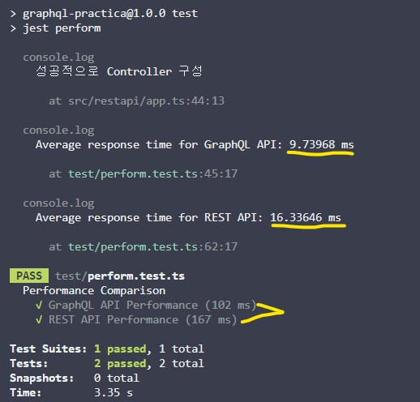
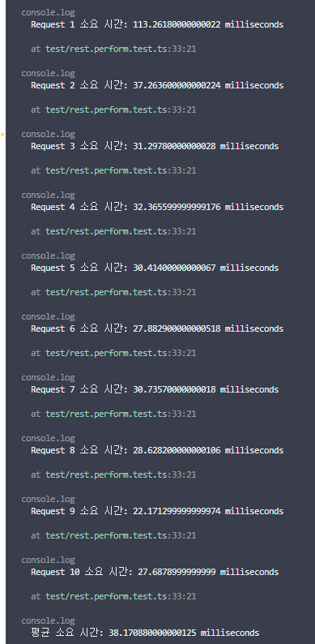
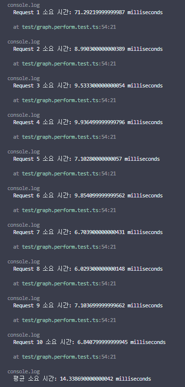
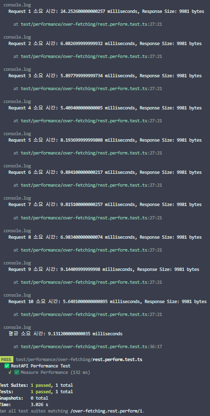
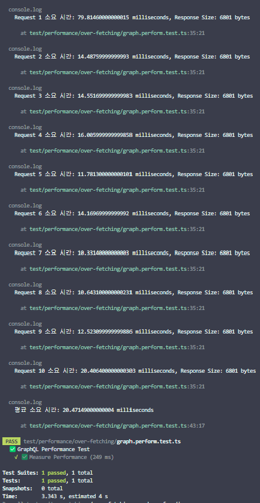

## 🗒️ 왜 해당 주제에 대한 예제를 제작하는가?

-   graphql이 Rest API 의 Over-fetching / Under-fetching에 얼마나 잘 대응하는지를 보여주기 위해서.

### Over-fetching이란

가져온 정보에서 필요한 정보는 한정적일 수도 있다. 하지만 Rest API로 호출을 하게되면, 불필요한 정보까지 가지고 오는 경우가 있다 이를 `Over-fetching` 이라고 한다.

> 서버의 자원이 낭비가 됨.

### Under-fetching이란?

프론트엔드의 하나의 페이지를 구성하기 위해서 프로필 정보, 게시물 정보, 댓글 정보등 많은 정보를 가지고 와야하지만, Rest api에서는 이러한 것을 각 부분에 따라 요청해야한다. 필요한 정보를 한번에 가져오지 못하는 것을 `Under-fetching` 이라고 한다.

> 서버에 요청량이 증가하게 됨.

### GraphQL의 등장

이러한 문제를 해결하기 위해서, 데이터를 가져오는 것에 필요한 것을 최적화하여 한번의 요청에 필요한 데이터를 가지고 오는 것을 주 목표로 하여 만들어졌다.

`GraphQL`과 `SQL`은 같은 Query Language이다. 간단히 말해서 질의형으로 요청하여 필요에 따른 응답을 받을 수 있는 것이다.

## 😊 ch1. Query를 통해 데이터를 가져오기

### hello world를 해보자

```tsx
import express, { Application } from "express";
import { ApolloServer } from "@apollo/server";
import { expressMiddleware } from "@apollo/server/express4";

const typeDefs = `#graphql
  type Query {
    hello: String
  }
`;

const resolvers = {
    Query: {
        hello: () => "world",
    },
};

export default async function createApp(): Promise<Application> {
    const app = express();
    const server = new ApolloServer({
        typeDefs,
        resolvers,
    });

    await server.start();
    app.use("/graphql", express.json(), expressMiddleware(server));

    return app;
}
```

위와 같이 코드를 구성하였다.

기본적으로 express를 사용하지않고 graphQL를 제작할 수 있지만, express와 함께 유연하게 동작하는 graphQL을 사용하도록 하는 것을 목표로 한다.

express의 미들웨어를 통해서 resolver에 접근하여 Query를 확인 후 답을 줄 수 있는 것이다.

현재 챕터에서 `npm test`를 통해서 테스트를 진행해보자.

```json
query : "query { hello }"
```

라는 형식의 쿼리를 json 형식으로 보내게 되면, 일반 Rest API와 같은 JSON형태로 응답을 받을 수 있게 된다. 해당 테스트는 이에 대한 부분을 직관적으로 확인할 수 있도록 구성했다..

## 😊 ch2. 간단하게 RestAPI 와 GraphQL 간의 비교

초기 챕터에서는 database를 사용하지않고 practice에 대해서 소개하려고 한다.

### 🚩초기 시나리오 구성

프로필 정보, 게시물, 댓글을 프론트에서 요청이 필요로 할 때:

-   REST API : 프로필 정보, 게시물, 댓글에 대한 요청을 따로 구성한다.
-   GraphQL : Query 기반으로 한번에 요청으로 가능하게 할 수 있다.

### 🏴REST API로 구성

`/api/profile`
`/api/board/:id`
`/api/comment`
로 구성할 것이다. 현재는 인증하는 것이 목적이 아니기 때문에, 인증부 없이 무조건적으로 1번user의 profile을 주도록 하겠다.

### 🏳️GraphQL로 구성

```graphQL
query {
    userProfile(id: 1) {
        id
        name
        email
        age
        phone
    }
    getBoard(id:1){
        postId
        userId
        title
        content
        timestamp
    }
    getComment(boardId:1){
        commentId
        postId
        userId
        content
        timestamp
    }
}
```

해당 쿼리를 통해 한번에 접근 가능, 해당 부분에서도 설명에 불필요한 내용은 제외하여 진행했다.

### ✅ 간단한 비교 분석

#### : 클라이언트가 원하는 응답을 준비할 수 있는 graphQL

`Rest API` 는 서버가 구성하고 있는 형태를 클라이언트에 필요에 따라 변경하려면 새로운 api 를 구성해야하는 번거러움이 존재할 수 있다.

하지만, `GraphQL`의 경우에는 그 때 그때 필요한 인자만을 받을 수 있기 때문에, 응답을 받는 것에 자유롭다.

#### : 과연 응답 속도가 정말 빠를까? 실제 실험을 해보자

`Rest API` 와 `GraphQL`에서 요청에 따른 속도 차이가 나타날 수도 있다고 했는데, 정말인지 확인하기 위해서 동일 서버 스펙에서 총 5번의 테스트를 진행해봤다.

`npm test perform`을 통해서 이를 확인할 수 있다!



perform에 대한 test를 진행한 결과 1.3 ~ 1.7 배 더 빠른 것으로 측정되었다. 이렇게 한 번에 많은 요청량이 client가 필요로 한다고 생각하면 편할 것이다.

> 많은 클라이언트는 하나의 페이지 단위에 여러 데이터를 얻기 위한 서로 다른 api요청을 반복한다.

## 😊 ch3. Under-Fetching과 Over-Fetching에 대한 사례와 GraphQL을 통한 극복

### ⬇️ Under-Fetching & 📈 Over-Fetching

GraphQL이 Rest API의 Under-Fetching과 Over-Fetching 같은 상황을 얼마나 잘 극복하는지에 대해서 소개하려고 한다.

`Under-Fetching`는 위의 예제와 비슷하다.

먼저 REST 구조를 시작으로 GraphQL까지 작성해보자.

#### 🚩Under-Fetching 시나리오

여행 리뷰 웹사이트에서 사용자의 프로필 정보를 포함한 특정 사용자의 작성한 리뷰 목록을 클라이언트에서 요청하는 상황을 고려해보자. 사용자는 여러 리뷰를 작성할 수 있으며, 각 리뷰에는 작성자의 정보가 포함되어 있다.

#### 🚩Over-Fetching 시나리오

현재 웹에서 사용자에 대한 기본 정보 (이름과 이메일)만을 보여주려고 한다. 해당 사항을 고려해보자.

#### 🗂️ 요구사항에 따른 필요 요소 추출

여기서 필요한 부분을 추출해보면 아래와 같다.

-   RestAPI
    -   유저 전체 정보 - `/api/user`
    -   유저 프로필 정보 - `/api/user/:userId`
    -   사용자 리뷰 목록 - `/api/user/:userId/review`
    -   리뷰 상세 정보 - `/api/review/:reviewId`
-   GraphQL

    -   typeDef Schema

        ```tsx
        export default `#graphql
            type User {
                id: Int!
                name: String!
                email: String!
                reviews: [Review]
            }
        
            type Review {
                reviewId: Int!
                content: String!
                score: Int!
                timestamp: String!
                author: User
            }
        
            type Query {
                user(id: Int): User
                users: [User]
                userReviews(userId: Int!): [Review]
                review(id: Int!): Review
            }
        `;
        ```

        > -   이러한 Schema 구조로 어떠한 데이터를 상호교환할지 표기함.
        > -   `reviews:[Review]`와 같은 Recursive한 구조 또한 가능

위와 같은 형태로 구분이 가능하다. 본 챕터부터 예제는 가독성을 위해 모듈화를 진행하면서 구조화를 하도록 하겠다.

#### 📁 폴더 구조

-   graphql
    -   loader
        -   express.ts
        -   graphql.ts
        -   index.ts
    -   schema
        -   resolver.ts
        -   typeDefs.ts
    -   app.ts
-   restapi
    -   api
        -   routes
            -   review.ts
            -   user.ts
        -   index.ts
    -   loaders
        -   index.ts
    -   app.ts

#### 💫performance

-   Under-Fetching

    | Test Description    | REST API Performance (ms)                  | GraphQL API Performance (ms)                |
    | ------------------- | ------------------------------------------ | ------------------------------------------- |
    | Measure Performance | 38.17                                      | 14.33                                       |
    | Image Data          |  |  |

-   Over-Fetching

    | Test Description    | REST API Performance (ms)                   | GraphQL API Performance (ms)                 |
    | ------------------- | ------------------------------------------- | -------------------------------------------- |
    | Measure Performance | 9.13                                        | 20.4                                         |
    | Image Data          |  |  |

`npm test perform`을 통해 성능을 측정해볼 수 있을 것이다.

#### 💫성능에 대한 차이가 존재하는 이유

간단하게 예시를 들어주겠다. 이 것은 마치 Buffering 개념과 비슷하다. 계란을 가지고 올 때, `바구니를 가지고 한번에 가져오는 것`과 `1개씩 왔다갔다 하면서 가져 오는 것` 딱 GraphQL과 Rest API는 해당 예시와 같은 차이가 난다.

**_Under-Fetching의 경우_** 는 REST API 에서 필요로 하는 데이터를 얻기 위해서는 여러번의 요청이 필요한 것이다. 결국 동일한 데이터를 얻는다고 가정하면 `왔다 갔다거리는 수고`만 더 추가 된 것이다.

이 것이 간단히 말해 성능차이에 큰 요인이 된 것이다.

이렇게 말하면 graphql 맹신론자와 같이 느껴질 수도 있지만, 그렇지는 않다. 쿼리 구조가 아직까진 단순해서 괜찮지만, 위에 `recursive 한 구조를 허용`한다는 말을 봤다면 예상하겠지만, 쿼리 구조가 복잡해질 수록 graphql 에서의 오버헤드가 발생할 수 있다는 점도 염두해두면 좋을 것 같다.

그러한 오버헤드를 제외하면 많은 이점들이 존재한다.

1. 복수 요청의 감소
2. 정확한 데이터 요청 (필요한 데이터만 가능)
3. 네트워크 트래픽 감소(단일 요청으로 데이터를 얻을 수 있기 때문에)

이러한, 이 점은 오히려 다양한 서비스를 만드는데 큰 도움을 줄 것이라 확신한다.

**Over-Fetching 예제의 경우**는 graphql에서 `오버헤드`가 발생하는 좋은 사례라고 생각한다.

> 다른 사람들: 방금까지만해도 GraphQl이 좋다고 했잖아요!

> **물론이다. 하지만 오버헤드를 고려해야한다.**

여기서 잠깐 주목하면 좋은 점은 Response Size이다. GraphQL이 Rest API 보다 훨씬 적다. 현재 실험 자체는 Local에서 진행했지만, 여러 remote 통신이 있을 때 Response Size가 낮은 즉, "대역폭"이 낮은 GraphQL이 유리해질 수 있다.

#### GraphQL의 오버헤드가 발생하는 이유

GraphQL에서 오버헤드가 발생하는 이유는 쿼리를 통한 질의나 요구에 맞게 데이터 해석과정을 거치기 때문에 응답할 데이터를 만들어내는데까지 시간이 오래걸리는 것이다.

이를 쿼리 최적화, Resolver 최적화 등과 같은 방법으로 해소할 수 있다. 이는 추후 챕터에서 소개할 예정이다.

지금까지의 내용으로 알았으면 좋겠는 점은 서로간의 **트레이드 오프**가 분명 존재한다는 것이다.
